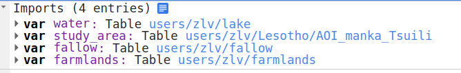
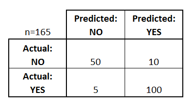

## Extracting a time-series water masks using Random Forest - Lesotho

In this tutorial, we will generate a land classification map 


with one month composite imagery from Sentinel-2 data. 

### Prepare Sentinel composite imagery

To understand the detail of this data used in this write-up, find the description [here](https://developers.google.com/earth-engine/datasets/catalog/COPERNICUS_S2_SR#description).

Import the sampled fallow land, farmland, and water source data, these data will be used to train and validate the classification result.



This block of code is to load the imageries taken in December 2020 from sentinel 2, with the cloud cover less than or equal to 1%. Load the user editable variables. Note that the code below have already included comments describing what each variable represents.

```javascript

// Creating bi-weekly image

function getBiweeklySentinelComposite(date) {
        
        var sentinel2 = ee.ImageCollection('COPERNICUS/S2_SR')
                            .filterBounds(region)
                            .filterDate(date, date.advance(2, 'week'))
                            .filterMetadata('CLOUD_COVERAGE_ASSESSMENT', 'not_greater_than', 1);
        
        var composite = sentinel2.median()
                            .set('system:time_start', date.millis(), 'dateYMD', date.format('YYYY-MM-dd'), 'numbImages', sentinel2.size());
        
        return composite;
      }

// Define the working region geometry
var region = study_area;

// Define time range
var startDate = '2020-12-01';
var endDate = '2020-12-31';
var biweekDifference = ee.Date(startDate).advance(2, 'week').millis().subtract(ee.Date(startDate).millis());
var listMap = ee.List.sequence(ee.Date(startDate).millis(), ee.Date(endDate).millis(), biweekDifference);


// Get biweekly sentinel2 for the date between start and end date
var sentinel2 = ee.ImageCollection.fromImages(listMap.map(function(dateMillis){
  var date = ee.Date(dateMillis);
  return getBiweeklySentinelComposite(date);
}));

```

### Creating indices for each image composite in the stacked image collection sentinel2.

Each of the index function is independently generated. In this ase, we are going to use the Sentinel Water Index (SWI), Normalized Difference Water Index (NDWI), Normalized Difference Vegetation Index (NDVI), Bare Soil Index (BSI), and Brightness Index as indicator variables to make the classification.

The below block of codes is used to generate the index layers.
```javascript

// Functions to add selected indices to the sentinel2 images
// -----------------------------------------------------------------------------
      
// Bands info: B2-Blue-10m; B3-Green-10m; B4-Red-10m; B5:RedEdge1; B6:RedEdge2; B7:RedEdge3;
// B8:NIR-10m; B9:Narrow NIR; B10:Water Vapor-60m; B10:SWIR-cirrus-60m; B111:SWIR1; B12:SWIR2

// VEGETATION INDICES (4)
//---------------------
      
function addNDVI(image) {
  // NDVI
  var ndvi = image.normalizedDifference(['B8', 'B4']).rename('NDVI')
                  .copyProperties(image,['system:time_start','system:time_end']);
  return image.addBands(ndvi).clip(region);
}
   
 

// WATER INDEX (4)
//---------------------
      
function addNDWI(image) {
  // NDWI, sensitive the buil-ups
  var ndwi = image.normalizedDifference(['B3', 'B8']).rename('NDWI');
  return image.addBands(ndwi).clip(region);
}
      
      
function addSWI(image) {
  // SWI
  var swi = image.normalizedDifference(['B5', 'B11']).rename('SWI');
  return image.addBands(swi).clip(region);
}
  
// SOIL INDEX (3)
//---------------------
function addBSI(image) {
  // Bare soil index: (B11+B4)-(B8+B2)/(B11+B4)+(B8+B2)
  var bsi = image.expression('((B11+B4)-(B8+B2))/((B11+B4)+(B8+B2))',{
    'B11': image.select('B11'),
    'B4': image.select('B4'),
    'B8': image.select('B8'),
    'B2': image.select('B2')
    }).rename('BSI');
    return image.addBands(bsi).clip(region);
}
      
      
function addBright(image){
    // BRIGHTNESS INDEX
    //sqrt(((Red * Red)/ (Green* Green))/2)
    var brightI = image.expression('sqrt(((B4*B4)/(B3*B3))/2)',{
      'B3': image.select('B3'),
      'B4': image.select('B4')
      }).rename('BRIGHTI');
    return image.addBands(brightI).clip(region);
}

// Filter out the image that have cloud > 1% cover
// Add the indices to each image in the collection
var Sentinel2idxCollection = sentinel2
    .map(function(image) {
      return image.set('count', image.bandNames().length())
    })
    .filter(ee.Filter.eq('count', 23))
    .map(addNDVI)
    .map(addNDWI)
    .map(addSWI)
    .map(addBSI)
    .map(addBright);

```

### Training sample collection for random forest

In this section, we are going to create a training dataset and testing dataset. The training dataset will be used to train the random forest model and generate the classification result. 

First, define the bands that will be used in the model.

```javascript

// Bands info: B2-Blue-10m; B3-Green-10m; B4-Red-10m; B5:RedEdge1; B6:RedEdge2; B7:RedEdge3;
// B8:NIR-10m; B9:Narrow NIR; B10:Water Vapor-60m; B10:SWIR-cirrus-60m; B111:SWIR1; B12:SWIR2

var bandlist = ['NDVI', 'NDWI', 'SWI', 'BSI', 'BRIGHTI'];
```
Second, 70% of the sample data will be used as training cases, and 30% will be used as testing cases. Define training/testing dataset in below:

```javascript


// Define training/validation data
// -----------------------------------------------------------------------------

var waterpoly = ee.FeatureCollection(water).map(function(feat)
                                                   {return feat.set('ld_code',0)}
                                                 );

var farmpoly = ee.FeatureCollection(farmlands).map(function(feat)
                                                   {return feat.set('ld_code',1)}
                                                 );

var fallowpoly = ee.FeatureCollection(fallow).map(function(feat)
                                                   {return feat.set('ld_code',2)}
                                                 );

var combined_data = waterpoly.merge(farmpoly).merge(fallowpoly)
                              .map(function(feature){
                                var num = ee.Number.parse(feature.get('ld_code'));
                                return feature.set('ld_code', num)});


// Add a random column and split the polydata into training and validation set
var combined_data = combined_data.randomColumn();

print(combined_data, 'combined data');

// 70% training, 30% validation

var trainingdata = combined_data.filter(ee.Filter.gte('random', 0.3));
var validationdata = combined_data.filter(ee.Filter.lt('random', 0.3));

Map.addLayer(trainingdata);
Map.addLayer(validationdata);
print(trainingdata, "training data");
print(validationdata, "validation data");

```

### Building a random forest classification

We will instantiate a classifier using ee.Classifier.smileRandomForest() and train it on the training data specifying the features to use (training), the land cover code as the classProperty we want to categorize the imagery into, and the selected list of indices from Sentinel imagery as the inputProperties.

```javascript

// Start working on Random Forest
// ---------------------------------------------------------------------------

// Random forest for one image
var time1=Sentinel2idxCollection.first();


// Sample the input imagery to get a FeatureCollection of training data.
var training = time1.select(bandlist).sampleRegions({
  collection: trainingdata, 
  properties: ['ld_code'],
  scale: 10
});


print("training", training.first());

// Make a Random Forest classifier and train it.

var classifier = ee.Classifier.smileRandomForest(50)
    //.setOutputMode('PROBABILITY')
    .train({
      features: training,
      classProperty: 'ld_code',
      inputProperties: bandlist
    });
    


// Classify the input imagery.
var classified = time1.select(bandlist).classify(classifier);


// Define a palette for the Land Use classification.
var palette = [
  'blue', // water (0)  // red
  'green', // farmland (1)  // green
  'brown' //  fallow/barren (2) // blue
];

// Display the classification result and the input image.
//print("classification output", classified);

Map.addLayer(classified.clip(study_area), {min: 0, max: 2, palette: palette}, 'classification');


```

### Accuracy Assessment using testing data.

Before we make use of the map we just created it's important to know just how accurate it is. For example, if the classified map shows that water occurred in a given area, how confident can we believe that the area is actually water?

A **confusion matrix** is the standard method for assessing the performance of a classification algorithm. It takes cases of known class (e.g. the training data or an independent validation data set) and compares them to their predicted class. The rows of the matrix are instances of the actual class, while the columns are instances of the predicted class. The diagonal of the matrix gives the number of correct classifications, while the off-diagonals give the number of incorrect classifications. For example, in this case we have two classes water and non-water, the matrix might look like:



[Chart Source](https://www.dataschool.io/simple-guide-to-confusion-matrix-terminology/)

In this example, 50 out 60 cases of class 1 were correctly classified, while 100 out of 105 cases of class 2 were correctly classified Looking at the off-diagonal components, in 10 cases class 1 was incorrectly assigned to class 2, and in 5 cases class 2 was incorrectly assigned to class 1. The overall accuracy is the total number of correct classifications as a proportion of the total number of cases, which in this case is 150 / 165 = 91%.

To calculate the confusion matrix and overall accuracy for the classification map, add the following code to the end of your script:


```javascript

//************************************************************************** 
// Accuracy Assessment
//************************************************************************** 

// Use classification map to assess accuracy using the testing data
var test = classified.sampleRegions({
  collection: validationdata,
  properties: ['ld_code'],
  scale: 10
});

var testConfusionMatrix = test.errorMatrix('ld_code', 'classification');
// Printing of confusion matrix may time out. 
print('Confusion Matrix', testConfusionMatrix);
print('Test Accuracy', testConfusionMatrix.accuracy());

```


### Export the classification result

The following code is used to export the classification layer you produced.

```javascript

// Data Exports
// -----------------------------------------------------------------------
// Exporting the probability and the binary classification result

Export.image.toDrive({image: classified,
                      description: 'farmland_rf_202012',
                      folder:'MCC_Lesotho',
                      scale: 10,
                      region: region,
                      fileFormat: 'GeoTiff',
                      crs: 'EPSG:3857',
                      maxPixels: 1808828538,
                      formatOptions: {cloudOptimized: true}
}); //1191858690

```


<!-- 


<center>

</center>


<center>

</center>

<center>

</center>

## Extract cell values

Finally, we need to combine these four training layers into one and extract the imagery cell values from within the polygons. This will produce a single table that associates pixels of each class with the spectral band values in those pixels. It's likely that when you selected polygons, some classes, such as unchanged forest, were easy to find examples of and therefore the training polygons for these classes cover a much larger area. Ideally we'd like the same number of training cells for each class. Furthermore, Earth Engine imposes usage limits and, if the training polygons contain too many cells, these limits will be exceeded and an error will be returned. To address this, we'll subsample within the polygons. Add the following code to the end of the script you already have.

```javascript
// subsample training polygons with random points
// this ensures all classes have same sample size
// also EE can't handle too many cells at once
var trainingLayers = [forest, forestLoss, nonforest, forestGain];
var n = 500;
// loop over training layers
for (var i = 0; i < trainingLayers.length; i++) { 
  // sample points within training polygons
  var pts = ee.FeatureCollection
    .randomPoints(trainingLayers[i].geometry(), n);
  // add class
  var thisClass = trainingLayers[i].get('class');
  pts = pts.map(function(f) {
    return f.set({class: thisClass});
  });
  // extract raster cell values
  var training = combined.sampleRegions(pts, ['class'], 30);
  // combine trainging regions together
  if (i === 0) {
    var trainingData = training;
  } else {
    trainingData = trainingData.merge(training);
  }
}
```

## Random forests

We now have our imagery and our training data and it's time to run the random forests classification. Add the following code to your script to fit a random forests model and plot the resulting forest change map.

```javascript
//// classify with random forests
// use bands 1-5 from each time period
var bands = ['B1_2001', 'B1_2011', 'B2_2001', 'B2_2011', 'B3_2001', 'B3_2011',
             'B4_2001', 'B4_2011', 'B5_2001', 'B5_2011'];
// fit a random forests model
var classifier = ee.Classifier.randomForest(30)
  .train(trainingData, 'class', bands);
// produce the forest change map
var classified = combined.classify(classifier);
var p = ['00ff00', 'ff0000', '000000', '0000ff'];
// display
Map.addLayer(classified, {palette: p, min: 0, max: 3}, 'classification');
```

Below is an example forest change map, yours may be slightly different since you likely chose different training areas. In this map forest is green, non-forest is black, forest loss is red, and forest gain is blue.

<center>

</center>

### Accuracy assessement

Before we make use of the map we just created it's important to know just how accurate it is. For example, if the classified map shows that forest loss occurred in a given area, how confident can we be that that area actually experienced forest loss?

A **confusion matrix** is the standard method for assessing the performance of a classification algorithm. It takes cases of known class (e.g. the training data or an independent validation data set) and compares them to their predicted class. The rows of the matrix are instances of the actual class, while the columns are instances of the predicted class. The diagonal of the matrix gives the number of correct classifications, while the off-diagonals give the number of incorrect classifications. For example, if we only had two classes, the matrix might look like:

$$
\begin{bmatrix}
10 & 2\\ 
3 & 5
\end{bmatrix}
$$

In this example, 10 out 12 cases of class 1 were correctly classified, while 5 out of 8 cases of class 2 were correctly classified Looking at the off-diagonal components, in 2 cases class 1 was incorrectly assigned to class 2, and in 3 cases class 2 was incorrectly assigned to class 1. The overall accuracy is the total number of correct classifications as a proportion of the total number of cases, which in this case is $15 / 20 = 75\%$.

To calculate the confusion matrix and overall accuracy for our forest change map add the following code to the end of your script:

```javascript
// accuracy assessement
var confMat = classifier.confusionMatrix();
print('Confusion matrix: ', confMat);
print('Overall accuracy: ', confMat.accuracy());
```

You should now see the confusion matrix and overall accuracy to the console:

<center>

</center>

In this case, our accuracy was quite good across all the classes, however, note that we used the training data to perform our validation. In practice it's best to collect an independent validation data set, or partition the training data set into training and validation subsets, in order to avoid bias in the accuracy assessment. This is possible in Earth Engine, however it is out of the scope of this tutorial.

## Conclusion

In this tutorial we used supervised classification to build a forest change map for a single Landsat scene in Brazil. However, this only scratches the surface of what's possible with Earth Engine. We could have extended our analysis to include a much larger region or to study land change in a different geographic location or biome. And, the applications aren't limited to land-cover change in the context of conservation, Earth Engine is broadly applicable to any task requiring analysis of spatiotemporal trends on the Earth's surface.

The [full script](https://code.earthengine.google.com/b2032d825436fe7e8018c3b64610cd89) for this tutorial is online. To learn more about Earth Engine complete the [Introduction to Earth Engine tutorial](https://developers.google.com/earth-engine/tutorials) if you haven't already. Then consult the [Earth Engine Guides](https://developers.google.com/earth-engine/), which provides excellent tutorials on all the major funcationality of Earth Engine. Finally, if at any point you get stuck, try reaching out to the [Earth Engine Google Group](https://groups.google.com/forum/#!forum/google-earth-engine-developers) for help.


 -->
 
