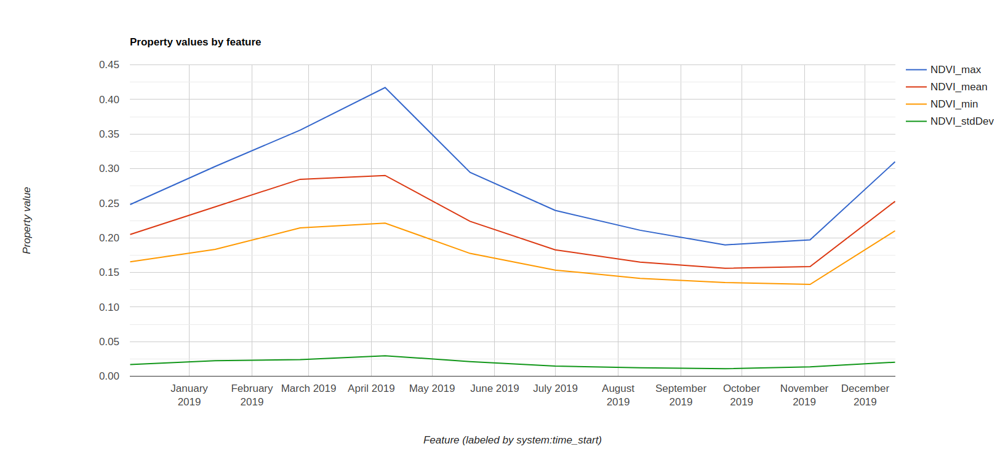

## Pixel level trends and Drawing the mix/max/mean trends of given area (Visualization)

This tutorial assumes people have basic knowledge about Google Earth Engine code editor.

### Pixel level NDVI trend

In this tutorial, it includes creating visualization chart to check on the trends of index change. We use the NDVI as an example to illustrate the code, you can define your own index and plot the chart.

First, we want to check on how does each pixel in a given study area (e.g. farmland) change overtime. In this way, we can track on the seasonal changes, strange un-expected index change overtime. 

Create the NDVI image collection. Read the random forest and threshold analysis tutorial to understand the below code.

```javascript

// Mapping the NDVI trends per pixels in a given area
// Add the polygon data

var poly = fpoly;
print(poly);

// Define the study area

var region = ee.Geometry.Rectangle(27.248340, -29.632341, 27.416364, -29.750510);

function getBiweeklySentinelComposite(date) {
        
        var sentinel2 = ee.ImageCollection('COPERNICUS/S2_SR')
                            .filterBounds(region)
                            .filterDate(date, date.advance(6, 'week'))
                            .filterMetadata('CLOUD_COVERAGE_ASSESSMENT', 'not_greater_than', 1);
        
        var composite = sentinel2.median()
                            .set('system:time_start', date.millis(), 'dateYMD', date.format('YYYY-MM-dd'), 'numbImages', sentinel2.size());
        
        return composite;
      }


function getNDVI(scene){
  // get a string representation of the date.
  var dateString = ee.Date(scene.get('system:time_start')).format('yyyy-MM-dd');
  var ndvi = scene.normalizedDifference(['B8', 'B4']).rename('NDVI');//.rename(dateString);
  return ndvi.copyProperties(scene,['system:time_start','dateYMD']);
}


// Define the data range

var startDate = '2019-01-01'
var endDate = '2020-01-01'
var biweekDifference = ee.Date(startDate).advance(6, 'week').millis().subtract(ee.Date(startDate).millis());
var listMap = ee.List.sequence(ee.Date(startDate).millis(), ee.Date(endDate).millis(), biweekDifference);

// Get biweekly sentinel2 data
var sentinel2 = ee.ImageCollection.fromImages(listMap.map(function(dateMillis){
  var date = ee.Date(dateMillis);
  return getBiweeklySentinelComposite(date);
}));

// Filter out non-band images
var filteredCollection = sentinel2
    .map(function(image) {
      return image.set('count', image.bandNames().length())
    })
    .filter(ee.Filter.eq('count', 23))


var NDVICollection = filteredCollection.map(getNDVI);
print("NDVICollection", NDVICollection);
```


Get all the point coordinates within the farmland polygon.

```javascript

// get coordinates image
var latlon = ee.Image.pixelLonLat();//.reproject(proj);


// put each lon lat in a list
var coords = latlon.select(['longitude', 'latitude'])
                 .reduceRegion({
                    reducer: ee.Reducer.toList(),
                    geometry: poly,
                    scale: 10
                  });

// get lat & lon
var lat = ee.List(coords.get('latitude'));
var lon = ee.List(coords.get('longitude'));
var point_list = lon.zip(lat);

// Create points
var mp = ee.Geometry.MultiPoint(point_list);

var mpCollection = ee.FeatureCollection(point_list.map(function(p){
  var point = ee.Feature(ee.Geometry.Point(p), {});
  return point;
}))

print("mpCollection", mpCollection);

Map.addLayer(mp,{}, 'Points');
Map.centerObject(poly);
Map.addLayer(NDVICollection.first().clip(region));
```

Creating the trend chart.

```javascript

var graph = ui.Chart.image.seriesByRegion({
  imageCollection: NDVICollection, 
  regions: mpCollection,
  reducer: ee.Reducer.mean(),
  scale:10
});


print("Feature chart");
print(graph);
```


### Tracking the NDVI min/max/mean/stdDev value change overtime for a given area

The code below is used to create the min/max/mean/stdDev trend overtime.

```javascript

// Tracking the max/mean/min/stdDev value trends of the given area
// ---------------------------------------

// Index comparison time series (draw mean, max, min, sd)

var farmIndices = NDVICollection.select(['NDVI']);
print("NDVI index", farmIndices);


var feats = farmIndices.map(function(image){
  //.combine(ee.Reducer.percentile([25,75],["25","75"]), '', true)
  var reducers = ee.Reducer.mean().combine(ee.Reducer.max(), '', true).combine(ee.Reducer.min(), '', true).combine(ee.Reducer.stdDev(),'',true);
  var stats = image.clip(fpoly)
                   .reduceRegion(reducers, region, 10);
  
  return ee.Feature(null, stats).set('system:time_start', image.get('system:time_start'));

});


var chart = ui.Chart.feature.byFeature(feats, 'system:time_start')
                //.setSeriesNames(['max', 'mean', 'min']);


print("feats", feats);
print("chart", chart);

```




<!-- 

<!-- 
<center>

</center>

Now click on the gear icon next to this new layer and fill in the details as highlighter in the image below. This layer will be for the first class: forest unchanged between 2001 and 2011. You need to give it a name ("forest"), set the type as "Feature" rather than Geometry, and add a new "class"" attribute (this will be class 0).

<center>

</center>

Now use all three layers of satellite imagery to identify regions that remain forest throughout the study period and create some polygons delineating these areas. Keep your polygons small and remember to capture the diversity within this class. Once you're done with this class, move on to the to the other classes, making sure to create a new layer for each and fill out the correct information in the layer properties. Call your layers: forest, forestLoss, nonforest, and forestGain.

Once you're done, scroll up to the top of the code editor and you'll see a new section where these polygon layers are imported. Be sure to save your code at this point so you don't loose these polygons!

<center>

</center>

## Extract cell values

Finally, we need to combine these four training layers into one and extract the imagery cell values from within the polygons. This will produce a single table that associates pixels of each class with the spectral band values in those pixels. It's likely that when you selected polygons, some classes, such as unchanged forest, were easy to find examples of and therefore the training polygons for these classes cover a much larger area. Ideally we'd like the same number of training cells for each class. Furthermore, Earth Engine imposes usage limits and, if the training polygons contain too many cells, these limits will be exceeded and an error will be returned. To address this, we'll subsample within the polygons. Add the following code to the end of the script you already have.

```javascript
// subsample training polygons with random points
// this ensures all classes have same sample size
// also EE can't handle too many cells at once
var trainingLayers = [forest, forestLoss, nonforest, forestGain];
var n = 500;
// loop over training layers
for (var i = 0; i < trainingLayers.length; i++) { 
  // sample points within training polygons
  var pts = ee.FeatureCollection
    .randomPoints(trainingLayers[i].geometry(), n);
  // add class
  var thisClass = trainingLayers[i].get('class');
  pts = pts.map(function(f) {
    return f.set({class: thisClass});
  });
  // extract raster cell values
  var training = combined.sampleRegions(pts, ['class'], 30);
  // combine trainging regions together
  if (i === 0) {
    var trainingData = training;
  } else {
    trainingData = trainingData.merge(training);
  }
}
```

## Random forests

We now have our imagery and our training data and it's time to run the random forests classification. Add the following code to your script to fit a random forests model and plot the resulting forest change map.

```javascript
//// classify with random forests
// use bands 1-5 from each time period
var bands = ['B1_2001', 'B1_2011', 'B2_2001', 'B2_2011', 'B3_2001', 'B3_2011',
             'B4_2001', 'B4_2011', 'B5_2001', 'B5_2011'];
// fit a random forests model
var classifier = ee.Classifier.randomForest(30)
  .train(trainingData, 'class', bands);
// produce the forest change map
var classified = combined.classify(classifier);
var p = ['00ff00', 'ff0000', '000000', '0000ff'];
// display
Map.addLayer(classified, {palette: p, min: 0, max: 3}, 'classification');
```

Below is an example forest change map, yours may be slightly different since you likely chose different training areas. In this map forest is green, non-forest is black, forest loss is red, and forest gain is blue.

<center>

</center>

### Accuracy assessement

Before we make use of the map we just created it's important to know just how accurate it is. For example, if the classified map shows that forest loss occurred in a given area, how confident can we be that that area actually experienced forest loss?

A **confusion matrix** is the standard method for assessing the performance of a classification algorithm. It takes cases of known class (e.g. the training data or an independent validation data set) and compares them to their predicted class. The rows of the matrix are instances of the actual class, while the columns are instances of the predicted class. The diagonal of the matrix gives the number of correct classifications, while the off-diagonals give the number of incorrect classifications. For example, if we only had two classes, the matrix might look like:

$$
\begin{bmatrix}
10 & 2\\ 
3 & 5
\end{bmatrix}
$$

In this example, 10 out 12 cases of class 1 were correctly classified, while 5 out of 8 cases of class 2 were correctly classified Looking at the off-diagonal components, in 2 cases class 1 was incorrectly assigned to class 2, and in 3 cases class 2 was incorrectly assigned to class 1. The overall accuracy is the total number of correct classifications as a proportion of the total number of cases, which in this case is $15 / 20 = 75\%$.

To calculate the confusion matrix and overall accuracy for our forest change map add the following code to the end of your script:

```javascript
// accuracy assessement
var confMat = classifier.confusionMatrix();
print('Confusion matrix: ', confMat);
print('Overall accuracy: ', confMat.accuracy());
```

You should now see the confusion matrix and overall accuracy to the console:

<center>

</center>

In this case, our accuracy was quite good across all the classes, however, note that we used the training data to perform our validation. In practice it's best to collect an independent validation data set, or partition the training data set into training and validation subsets, in order to avoid bias in the accuracy assessment. This is possible in Earth Engine, however it is out of the scope of this tutorial.

## Conclusion

In this tutorial we used supervised classification to build a forest change map for a single Landsat scene in Brazil. However, this only scratches the surface of what's possible with Earth Engine. We could have extended our analysis to include a much larger region or to study land change in a different geographic location or biome. And, the applications aren't limited to land-cover change in the context of conservation, Earth Engine is broadly applicable to any task requiring analysis of spatiotemporal trends on the Earth's surface.

The [full script](https://code.earthengine.google.com/b2032d825436fe7e8018c3b64610cd89) for this tutorial is online. To learn more about Earth Engine complete the [Introduction to Earth Engine tutorial](https://developers.google.com/earth-engine/tutorials) if you haven't already. Then consult the [Earth Engine Guides](https://developers.google.com/earth-engine/), which provides excellent tutorials on all the major funcationality of Earth Engine. Finally, if at any point you get stuck, try reaching out to the [Earth Engine Google Group](https://groups.google.com/forum/#!forum/google-earth-engine-developers) for help.


 -->
 
